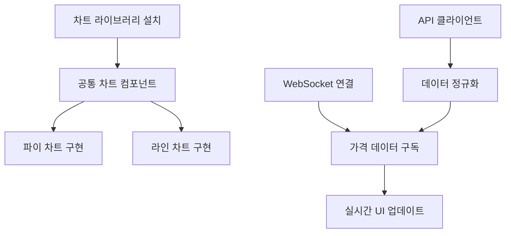

# FluxAI Capital - Task Management Guide

## 📋 태스크 구조 개요

### 현재 진행 상황
- **Phase 1 완료율**: 80% (120/150 시간)
- **현재 단계**: Phase 1 미완료 기능 세분화 작업
- **다음 마일스톤**: Phase 2 실시간 데이터 연동

## 🎯 우선순위별 태스크 분류

### ⚡ 즉시 실행 가능 (1-3시간)
```
immediate-tasks/quick-wins:
- responsive-1: 모바일 브레이크포인트 CSS 수정 (2h)
- loading-states-1: 로딩 스피너 컴포넌트 추가 (1h)  
- error-handling-1: 에러 바운더리 컴포넌트 (2h)
- darkmode-4: 로컬스토리지 테마 저장 (1h)
```

### 🔧 단기 완성 (4-8시간)
```
phase1-remaining/dash-widgets:
- mini-chart-2: 자산 가치 트렌드 미니 차트 (4h)
- period-tabs-3: 기간별 수익률 계산 함수 (4h)

phase1-remaining/chart-integration:  
- pie-chart-1: 자산 배분 파이 차트 (4h)
- line-chart-1: 포트폴리오 성과 라인 차트 (4h)
```

### 📈 중기 개발 (10-20시간)
```
phase2-detailed/realtime-data:
- websocket-1~3: WebSocket 연결 시스템 (9h)
- price-update-1~2: 실시간 가격 UI (5h)

phase2-detailed/market-data-api:
- upbit-api-1~2: 업비트 API 통합 (7h)  
- binance-api-1~2: 바이낸스 API 통합 (7h)
```

## 📊 태스크 의존성 관계



## 🔄 권장 실행 순서

### Week 1: 기본 차트 완성
1. `chart-lib-1`: Recharts 설치 (1h)
2. `chart-lib-2`: 차트 테마 정의 (2h) 
3. `chart-wrapper-1`: 공통 래퍼 컴포넌트 (3h)
4. `pie-chart-1`: 자산 배분 파이 차트 (4h)
5. `mini-chart-2`: 미니 차트 구현 (4h)

**주간 목표**: 14시간, 차트 시스템 완성

### Week 2: 대시보드 완성
1. `period-tabs-1~3`: 기간별 탭 시스템 (9h)
2. `portfolio-table-1~2`: 보유 자산 테이블 (5h)
3. `responsive-1~2`: 반응형 개선 (5h)

**주간 목표**: 19시간, 대시보드 UI 완성

### Week 3: 실시간 데이터
1. `websocket-1`: WebSocket 연결 (4h)
2. `upbit-api-1`: 업비트 REST API (4h)  
3. `websocket-2`: 가격 구독 시스템 (3h)
4. `price-update-1`: 실시간 UI 반영 (3h)

**주간 목표**: 14시간, 실시간 데이터 연동

## 📝 태스크 상태 관리

### 상태 정의
- `pending`: 시작 전
- `in_progress`: 진행 중  
- `completed`: 완료
- `blocked`: 의존성으로 인한 대기
- `deferred`: 연기됨

### 시간 추정 가이드
- **1-2시간**: 간단한 UI 컴포넌트, 설정
- **3-4시간**: 중간 복잡도 기능, API 연동
- **5-8시간**: 복잡한 비즈니스 로직, 차트 구현
- **8시간+**: 시스템 레벨 기능, 아키텍처 변경

## 🚀 다음 단계 계획

### Phase 1.5: 사용자 경험 완성 (40시간)
- 반응형 디자인 완성
- 로딩 상태 및 에러 처리
- 다크 모드 구현
- 성능 최적화

### Phase 2: 고급 기능 (100시간)  
- 실시간 데이터 연동
- 리스크 관리 시스템
- 고급 차트 분석
- 외부 API 통합

### Phase 3: AI 통합 (150시간)
- 머신러닝 모델 통합
- 자동매매 시스템
- 포트폴리오 최적화
- 예측 분석

## 📞 작업 시 참고사항

1. **시작 전 확인**:
   - 의존성 태스크 완료 여부
   - 필요한 라이브러리/API 키 준비
   - 관련 문서 리뷰

2. **진행 중 체크**:  
   - 매 2시간마다 진행상황 업데이트
   - 예상 시간 초과 시 태스크 분할 검토
   - 블로커 발생 시 즉시 상태 변경

3. **완료 후**:
   - 관련 문서 업데이트
   - 다음 의존 태스크 unlock
   - 코드 리뷰 및 테스트 수행